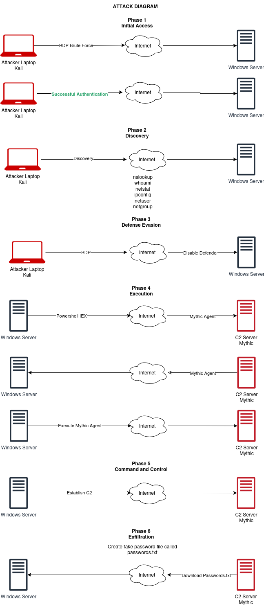

# Day 19: Creating an Attack Diagram

**Week:** 3 | **Phase:** Documentation & Planning
**← [Back to README](../../README.md) | [← Day 18](./day-18-c2-theory.md)**

---

## 1. Introduction

**Goal:** Create an attack diagram to plan the attack on the target machine and establish a C2 connection.

---

## 2. Tools

**[Draw.io](https://www.draw.io/)** — Used to create the attack diagram.

---

## 3. Attack Diagram Components

| Component | Colour | Role |
|-----------|--------|------|
| Mythic C2 Server | Red | Command and control server |
| Windows Server | — | Target machine |
| SSH Server | — | Potential future target |
| Attacker Laptop (Kali Linux) | Red | Attack origin |
| Internet | — | Connection medium |

---

## 4. Attack Phases

### Phase 1: Initial Access
- **Method:** RDP Brute Force
- **Goal:** Successful authentication

### Phase 2: Discovery
- **Commands:** `whoami`, `ipconfig`, `net user`, `net group`
- **Goal:** Check permissions and gather information

### Phase 3: Defence Evasion
- **Action:** Disable Windows Defender
- **Goal:** Bypass endpoint protection

### Phase 4: Execution
- **Method:** Download Mythic agent via PowerShell (`IEX` — Invoke Expression)
- **Goal:** Execute Mythic agent on Windows Server

### Phase 5: Command and Control (C2)
- **Action:** Establish C2 session with Mythic agent
- **Goal:** Gain control over the Windows Server

### Phase 6: Exfiltration
- **Action:** Create a fake password file (`passwords.txt`) on Windows Server
- **Goal:** Use C2 session to download `passwords.txt` and analyze telemetry

---

## 5. Diagram

---

*→ Next: [Day 20 — Mythic C2 Setup](./day-20-mythic-c2-setup.md)*
